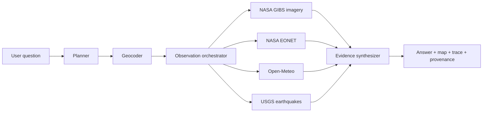

# Parallax: Agentic Satellite Query Engine

Parallax is an agentic satellite query engine. A user asks a natural-language
question about a place, and the system turns it into an observation plan,
collects fresh Earth-observation context, and returns a grounded answer with a
visible reasoning trace and source provenance.

## What It Does

- Accepts questions such as “Are there active wildfires near Los Angeles?”
- Resolves a location anywhere in the world with OpenStreetMap Nominatim.
- Uses an AI planner to select an observation intent and geographic radius.
- Probes five NASA VIIRS/MODIS feeds and selects the freshest usable scene.
- Adds current weather, NASA natural events, and USGS seismic evidence.
- Uses OpenAI vision to inspect the satellite snapshot when an API key is set.
- Uses NASA FIRMS VIIRS hotspots when a free FIRMS key is configured.
- Clearly labels the deterministic fallback when no AI key is available.
- Shows every agent step, duration, confidence, caveat, and source.
- Saves every query to a persistent visual history.
- Shows the exact satellite image passed into the AI model inside the agent trace.
- Generates deep-research-style reports rendered in the app and saved as
  Markdown and PDF files.

## Product Pages

- **Home:** explains how the agent and near-real-time imagery work.
- **System:** offers both product-facing and academic explanations of the
  architecture, model roles, data contracts, evaluation, and limitations.
- **Explore:** runs satellite investigations and exposes the agent trace.
- **History:** reopens saved investigations with their original evidence.
- **Reports:** reads and downloads permanent research artifacts.

## Architecture



The detailed design is in [docs/ARCHITECTURE.md](docs/ARCHITECTURE.md).

## Run Locally

Requirements: Node.js 20 or newer.

```bash
npm install
cp .env.example .env
npm run dev
```

Open [http://localhost:5173](http://localhost:5173).

The live data pipeline works immediately in `Evidence fallback` mode. To enable
the actual AI planner and visual satellite analysis:

```bash
OPENAI_API_KEY=your_key_here
OPENAI_MODEL=gpt-5.4-mini
FIRMS_MAP_KEY=your_free_nasa_firms_key
```

Keep the key server-side. It is never sent to the browser.

- Get an [OpenAI API key](https://platform.openai.com/api-keys).
- Request a free [NASA FIRMS map key](https://firms.modaps.eosdis.nasa.gov/api/map_key/).

The OpenAI key turns on the actual AI planning and image-analysis stages. The
FIRMS key is optional but replaces slower event records with timestamped VIIRS
fire detections.

## Commands

```bash
npm run dev       # Vite client + Node API
npm test          # Unit tests
npm run build     # Production client build
npm start         # Serve API and built client
```

## API

### `POST /api/query`

```json
{
  "question": "Are there active wildfires near Los Angeles?"
}
```

Returns:

- resolved location and area of interest
- selected observation intent
- NASA imagery metadata and preview URL
- current environmental evidence
- synthesized assessment and confidence
- agent execution trace
- source provenance

Every successful query is automatically stored in `data/store.json`.

### History and reports

```text
GET  /api/history
GET  /api/history/:id
POST /api/history/:id/report
GET  /api/reports
GET  /api/reports/:id
GET  /api/reports/:id/download/markdown
GET  /api/reports/:id/download/pdf
```

Report artifact folders contain the exact satellite image used by the agent,
the Markdown report, and the rendered PDF. Runtime history and reports live
under `data/` and are excluded from Git.

### `GET /api/imagery`

Proxies a bounded NASA GIBS WMS image for the selected location, date, layer,
and radius.

### `GET /api/health`

Reports API status and whether OpenAI vision is enabled.

## Demo

The recommended three-minute presentation flow is in
[docs/DEMO_SCRIPT.md](docs/DEMO_SCRIPT.md).

## Honest Product Boundary

“Real time” satellite imagery is usually near-real-time. Parallax checks
today first across NOAA-21, NOAA-20, Suomi NPP, Aqua, and Terra, validates that
the returned image contains usable data, and only then moves backward up to
three days. These are polar-orbiting observations, not live video, and their
regional resolution cannot support street-level claims.

## Data Providers

- [NASA GIBS](https://www.earthdata.nasa.gov/eosdis/science-system-description/eosdis-components/gibs)
- [NASA EONET](https://eonet.gsfc.nasa.gov/docs/v3)
- [Open-Meteo](https://open-meteo.com/en/docs)
- [USGS Earthquake Catalog](https://earthquake.usgs.gov/fdsnws/event/1/)
- [OpenStreetMap Nominatim](https://nominatim.org/release-docs/latest/api/Search/)
- [OpenAI Responses API](https://developers.openai.com/api/docs/guides/images-vision)

## AI Usage Disclosure

AI tools assisted with project ideation, implementation, debugging, interface
design, documentation, and presentation development. The resulting source,
tests, product decisions, limitations, and external-provider integrations were
reviewed and iterated as part of this course project.

At runtime, OpenAI models are used for bounded observation planning,
multimodal image analysis, and optional report drafting. Parallax does not
train or fine-tune a new model. Query-specific NASA imagery and public
environmental data are supplied at inference time, and the exact image passed
to the model is shown in the agent trace.

## Acknowledgements

Parallax uses open data and software from NASA Earthdata/GIBS, NASA FIRMS, NASA
EONET, USGS, OpenStreetMap contributors and Nominatim, Open-Meteo, OpenAI,
React, Express, Leaflet, Sharp, ReportLab, shadcn/ui, Radix UI, and Lucide.
