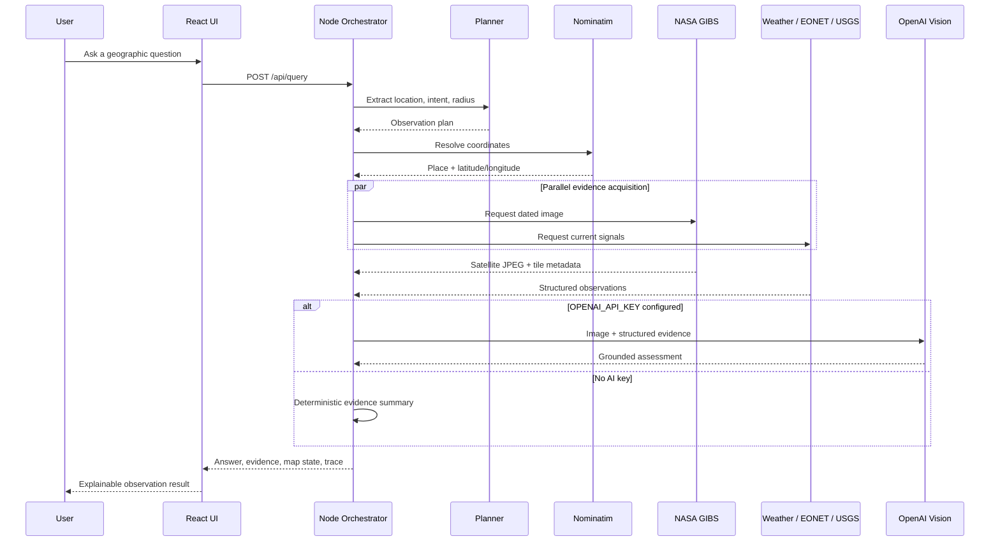

# Parallax System Design

## 1. Product Goal

Parallax answers geographic questions with the freshest evidence available
from satellite imagery and live public data feeds. The core product promise is
not “the model knows.” It is “the system acquired evidence, recorded where it
came from, and explained what that evidence supports.”

### Primary user story

> As a user, I can ask a question about a place in normal language and receive
> a timely, map-based answer with confidence, caveats, and sources.

### Demo success criteria

1. The user can query any geocodable location.
2. The map moves to the selected area and loads date-specific satellite tiles.
3. The answer includes fresh external evidence and source links.
4. The UI exposes the agent’s steps rather than presenting a black box.
5. The product remains usable without a paid API key.

## 2. High-Level Architecture



## 3. Agent Design

The agent is a bounded orchestrator with four explicit stages.

### Stage 1: Plan

Input: raw user question.

Output:

```json
{
  "locationText": "Los Angeles",
  "intent": "wildfire",
  "radiusKm": 250
}
```

With an OpenAI key, a language model produces this plan. Without a key, a local
intent classifier and location extractor provide the same contract.

### Stage 2: Locate

Known demo locations resolve instantly. Other places use Nominatim. The system
stores a human-readable place name and WGS84 coordinates.

### Stage 3: Gather

The orchestrator requests independent providers in parallel:

| Provider | Role | Freshness |
| --- | --- | --- |
| NASA GIBS / VIIRS + MODIS | Freshest usable optical image and map tiles | Daily polar overpasses |
| NASA FIRMS | Timestamped VIIRS active-fire detections | Under 60 minutes for RT data; faster URT in supported regions |
| NASA EONET | Open natural-event records | Provider-dependent |
| Open-Meteo | Current atmospheric context | Current model/observation interval |
| USGS | Recent earthquakes | Near-real-time catalog |

Provider failure is isolated with `Promise.allSettled`. A weather outage should
not prevent the satellite image or event feed from producing a result.

### Stage 4: Synthesize

AI mode sends the NASA image and structured evidence to a vision-capable model.
The system prompt requires:

- observed facts separated from inference
- an integer confidence score
- explicit cloud/resolution/freshness caveats
- compact observations suitable for the UI

Fallback mode never pretends to visually inspect the image. It summarizes
metadata and corroborating feeds and clearly states that visual interpretation
is disabled.

### Freshest-image selection

For each query, the acquisition layer probes the current UTC date across:

1. NOAA-21 / VIIRS
2. NOAA-20 / VIIRS
3. Suomi NPP / VIIRS
4. Aqua / MODIS
5. Terra / MODIS

Each low-resolution probe is decoded and scored for pixel variation and
entropy. Empty or nearly uniform responses are rejected. The selector chooses
the strongest usable scene on the newest date and only moves backward when no
sensor has usable coverage for the target.

## 4. Frontend Design

The client is a two-surface workspace:

- **Observation surface:** Leaflet map, dated NASA tile layer, area-of-interest
  ring, target point, and event markers.
- **Analysis rail:** query composer, answer, confidence, image crop, live
  signals, caveats, agent trace, and source provenance.

The visual system uses a dark operations-console palette with a high-contrast
acid green reserved for active states and verified completion.

## 5. Data Contract

The query response is deliberately inspectable:

```text
result
├── location
├── intent
├── imagery
├── answer
│   ├── headline
│   ├── summary
│   ├── confidence
│   ├── observations[]
│   └── caveats[]
├── evidence
│   ├── weather
│   ├── events[]
│   ├── earthquakes[]
│   └── sources[]
└── trace[]
```

This contract can later support streaming, saved investigations, alerts, and
multi-date change detection without replacing the interface.

## 6. Persistence and Reports

Parallax uses a lightweight JSON repository for the course-project
deployment:

```text
data/
├── store.json
└── reports/
    └── <report-id>/
        ├── imagery.jpg
        ├── report.md
        └── report.pdf
```

Every successful query is saved automatically. Reports reference a saved query
snapshot and copy the exact image used in that run, which prevents a report
from changing when newer satellite imagery becomes available.

The research agent receives the saved image and structured evidence, produces a
grounded Markdown report, and is required to separate image observations,
external event records, and inference. A deterministic template remains
available when AI report generation fails. A ReportLab renderer converts the
same Markdown artifact into a paginated PDF with embedded imagery, tables,
headers, footers, and source links.

## 7. Reliability and Safety

- API keys remain on the server.
- All upstream calls use timeouts.
- Provider failures degrade independently.
- The output labels near-real-time imagery accurately.
- Confidence is visible and never presented as a calibrated probability.
- The AI prompt forbids claims beyond image resolution and cloud visibility.
- Source links are attached to every result.
- Nominatim is used for single user-initiated searches, not autocomplete.

## 8. Current Limitations

1. Optical imagery can be obscured by clouds, smoke, darkness, or missing
   orbital coverage.
2. MODIS is regional-scale imagery. It cannot identify people, vehicles, or
   individual buildings reliably.
3. A single image is weak evidence for “change.” Production change detection
   needs at least two cloud-screened observations.
4. EONET is an event aggregator, not an exhaustive emergency alert system.
5. The demo does not persist sessions or implement user accounts.
6. Provider rate limiting and production caching are not yet implemented.

## 9. Production Roadmap

### Phase 1: Better sensing

- Add Sentinel-2 and Landsat scenes through a STAC catalog.
- Add VIIRS active-fire detections and flood-specific radar products.
- Select sensors by intent, cloud cover, resolution, and recency.

### Phase 2: Temporal reasoning

- Retrieve a baseline and latest cloud-free scene.
- Calculate spectral indices such as NDVI, NBR, and NDWI.
- Add pixel-level change masks before model synthesis.

### Phase 3: Operational agent

- Stream tool events to the UI with server-sent events.
- Cache geocoding and imagery metadata.
- Add provider retries, circuit breakers, and observability.
- Store investigations and schedule area monitors.

## 10. Evaluation Plan

Build a benchmark of questions across wildfire, flood, storm, vegetation,
snow/ice, earthquake, urban, and general queries.

Measure:

- location resolution accuracy
- intent and radius selection accuracy
- imagery availability
- provider latency and failure rate
- factual agreement with source records
- unsupported visual-claim rate
- usefulness and calibration ratings from human reviewers

The most important metric is the unsupported-claim rate. A cautious partial
answer is better than a visually plausible fabrication.
